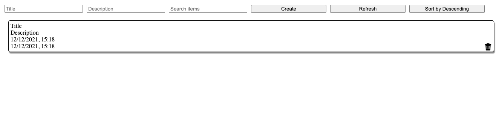
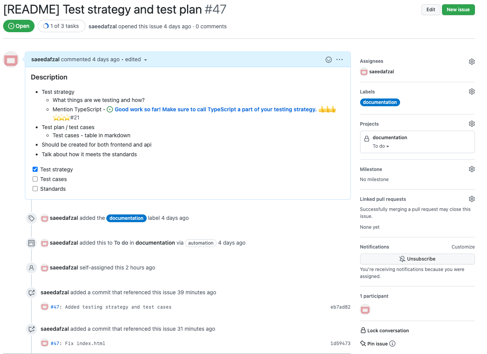
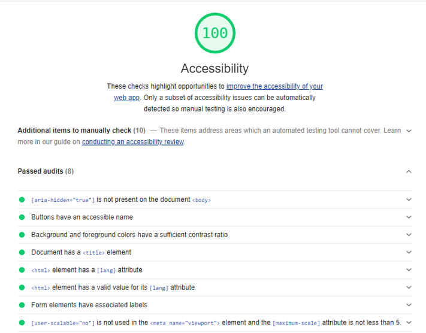

# sqa-nov-2021-team7

**Google Meet Link**  
https://meet.google.com/jqg-jvhc-uvk

## The Team
|    Name    | GitHub |
|:----------:|:------:|
| Samuel Crispin - **Developer & Tester** | [](https://github.com/SamCrispin) |
| Hou Fai Man - **Developer & Tester** | [](https://github.com/houfaiman) |
| Saeed Afzal - **Developer & Tester** | [](https://github.com/saeedafzal) |

## About the Project


This repository contains a web application developed using TypeScript that enables users to create, read, update and delete
todo items. TypeScript was used to enforce strict typing and good coding practices for both the source code and the tests.
It is a full-stack project that contains a frontend written in the [React](https://reactjs.org/) framework and 
is powered by a backend server using the [Express](http://expressjs.com/) framework.

Data is persisted in-memory as a cache. It does not have a database connection, however discussions were made
about the potential solutions in the future such as MongoDB. This means that any data that was created
during the server's uptime will be lost when the server is shut down or restarted.

## Features
- Create, Read, Update, and Delete
- Searching
- Sorting

## Roadmap
- Prioritisation
  - Sorting
- MongoDB Integration
- Subtasks
- Accounts
- Locations
- Notifications

## Dependencies
The project uses the following dependencies to build and test the application:
- [TypeScript](https://www.typescriptlang.org/) (Strongly typed JavaScript)
- [Vite](https://vitejs.dev/) (Frontend tooling)
- [Express](https://expressjs.com/) (Web framework for Node.js)
- [React](https://reactjs.org/) (JavaScript library for building user interfaces)
- [Eslint](https://eslint.org/) (JavaScript linter)
- [Styled Components](https://styled-components.com/) (Inline styling for React components)
- [Axios](https://axios-http.com/) (Promise-based HTTP client)
- [Jest](https://jestjs.io/) (JavaScript testing framework)
- [Cypress](https://www.cypress.io/) (End-to-End testing framework)
- [Testing Library](https://testing-library.com/) (A utility library for React testing)

### Prerequisites

To build and run this project, you will need the following:
* [Node.js](https://nodejs.org/en/) - Note: Version 17 and above is incompatible with Cypress and will not run the tests. 
If you are using the latest version, please downgrade to 16.13.1 LTS.
* [Python 3](https://www.python.org/) - Running the load tests scripts.

## Usage
From the root directory:
### Server - http://localhost:8080
```bash
cd api 
npm install
npm start
```

### Frontend - http://localhost:3000
```bash
cd client
npm install
npm start
```

## Running tests

### Unit Tests
```bash
cd client
npm test
# Generate coverage report
npm run test:coverage
```

### Integration Tests
```bash
cd api
npm test
# Generate coverage report
npm run test:coverage
```

### End-To-End Tests
```bash
cd client
npm run cypress:open
```

### Load Tests
See [readme](./load_tests/README.md) for instructions.

## Project Structure

### API
```
api - Directory for the API server project
    src - source code for the server
        core - core functionality
        routes - endpoints routes
    tests - integration tests
```

### Client
```
client - Directory for the frontend project
    cypress - end-to-end tests
        fixtures - responses for mocked endpoints 
        integration - integration tests
        plugins - configurations for running Cypress
        support - Additional commands for running Cypress
    mocks - Mocks for Jest
    src - source code for the frontend
        components - custom React components
        services - services for integrating with server
        types - type declarations for data models
    tests - unit and component tests
```


## Coding Standards
Coding standards were a topic discussed among the team to keep the codebase uniformed, 
readable and maintainable by all members. This was enforced by creating a list of linting rules
that is checked by the continuous integration pipeline, and is executed every time a developer pushes
new changes remotely.

### Below are some coding standards that were enforced:
- Indentation: Enforces all members to have a consistent indentation style. By default, this is set to four spaces 
or a single tab.
- Semi-colons: Promotes readability as developers can see where statements end and also prevents potential errors.
- Unused variables: Keeps the codebase clean and does not waste memory usage.
- Camelcase: Enforces all developers to create variables and methods in the same format that can be read by
everyone.
- Magic numbers: Provides context and reason behind what the variable is about.
- File names: All test files must be named `*.spec.ts` for Cypress and `*.test.ts` for Jest.

There are two approaches to creating a custom React component. ES6-styled classes can be created that extends
the Component interface or by creating components in a functional style. This project uses the latest version
of React, thus the team decided to follow the latter approach as the team behind this framework suggests functional
components are best practices. Using this approach means there is a performance boost and provides developers access
to some React hooks that are not present when using classes.

## Pull Requests Review Rules
Developers often use pull requests to merge changes from the feature branch to the main
branch. It is a way to have your code changes peer reviewed before it is merged. The peer
review process varies depending on the team. In this team, a couple of rules were established before
a pull request can be merged:

* **Green Builds** - There are multiple CI/CD workflows that run when a pull request is created or updated. These builds
need to pass.
* **Review Process** - All developers must write tests for the changes they have created. If tests are missing, this gets
pointed out by the reviewers. This also includes enforcing coding standards.
* **Approvals** - All changes require 2 approvals.
* **Stale Approvals** - Any new updates on a pull request removes any existing approvals, and must be requested again.
* **Merge Conflicts** - Developers must ensure no changes are conflicting with the main branch.


## Testing Strategy
The codebase is written using TypeScript, which is a superset of JavaScript. It ensures that the code is type-safe which makes
the code easier to read and reduces errors. It also allows the creation of interfaces to define an entity to which the
rest of the code must adhere to.

For the front-end project, Cypress was chosen for the end-to-end tests. Cypress is an all-in-one end-to-end testing framework
that includes an assertion and mocking/stubbing library that enables developers to create automated tests for web applications.
It has a powerful test runner that allows developers to specify how the components behave. It also includes tools that can
send HTTP requests to an endpoint and assert that components have been rendered on the page. This is a valuable tool that
assures the API and the frontend are integrated together, and assures regressions are not introduced when new features are
developed.

For API testing, there are libraries such as Supertest that allows developers to create integration tests by
running a HTTP request in the code. This works when developing using a test-driven development style as you can set up the
expected results first, and then develop the API to make the tests pass.

To manually test the APIs, this can be done using a popular API testing tool called Postman. It allows testers to send HTTP
requests where you can set headers and parameters for each request. You can group and save requests to run again which will
be useful as there are quite a few API applications in the architecture and being able to test them efficiently is important.

Unit tests are a tried and tested way of ensuring code logic is working as expected. While there are many libraries that can
be used, Jest is a popular and easy library which has a built-in mocking system and test runner. With integration tests
covering the bulk of the tests, unit tests will be used for ensuring certain logic works as it should.

## Test Cases
| No. |                                                    Assumptions                                                     |                            Criteria                             |                                                     Steps                                                     |                                     Expected Results                                      |                                                       Actual Results                                                       | Result |
|:---:|:------------------------------------------------------------------------------------------------------------------:|:---------------------------------------------------------------:|:-------------------------------------------------------------------------------------------------------------:|:-----------------------------------------------------------------------------------------:|:--------------------------------------------------------------------------------------------------------------------------:|:------:|
|  1  |                                         User is accessing the todo client                                          |     Check the create button works as per the specification      | 1. Open the todo client<br/>2. Enter the title<br/>3. Enter the description<br/>4. Click on the create button | The interface should show a successful feedback and the todo item is rendered on the page | The interface shows the successful feedback and a todo item is rendered on the page with the correct title and description |  Pass  |
|  2  |                           User is accessing the todo client and has existing todo items                            |       Check that the todo items are rendered on page load       |                                            1. Open the todo client                                            |                The interface should show a list of todo items on the page                 |                                         The interface renders a list of todo items                                         |  Pass  |
|  3  |                         User is accessing the todo client and has two existing todo items                          |   Check that the delete button works as per the specification   |                 1. Open the todo client<br/>2. Click on the bin icon for the first todo item                  |                 The interface should show a single todo item on the page                  |                         The interface updates automatically and displays a single item on the page                         |  Pass  |
|  4  |          User is accessing the todo client and has two existing todo items one with the title of "hello"           | Check that the searching feature works as per the specification |                1. Open the todo client<br/>2. Click on the search input<br/>3. Type in "hello"                |              The interface should show the todo item with the "hello" title               |                                  The interface shows the todo item with the "hello" title                                  |  Pass  |
|  5  | User is accessing the todo client and has two existing todo items one with the created date earlier than the other |  Check that the sorting feature works as per the specification  |                    1. Open the todo client<br/>2. Click on the 'Sort by Ascending' button                     |               The interface should show the todo item created earlier first               |                                  The interface shows the todo item created earlier first                                   |  Pass  |

## IEEE Standard
### 4.8 Problem reporting and corrective action (section 8 of the SQAP)
#### a) Describe the practices and procedures to be followed for reporting, tracking, and resolving problems or issues identified in both software items and the software development and maintenance process.
* This project uses GitHub Kanban Board to monitor and track issues.
* All issues are tagged with labels indicating the type of issue.
* Issues can be linked to pull requests; when pull requests are merged, the issue is closed automatically.


* Issues can be linked to other issues to manage dependencies between them.
* It also shows if progress is blocked due to other dependencies.
* Visual progress can be seen through commits providing the commit message has the issue number.
* Issues can have a checklist of tasks, which GitHub renders the progress off.

To create an issue, you click on the green "New Issue" button. In the description box, you can type out the details of the
problem or the work that needs to be done. Labels can be optionally provided to describe what the task entails. To pick up an item,
you assign the user to it.

#### b) State the specific organizational responsibilities concerned with their implementation.
The organisation's responsibility is to ensure the application works as expected, and to ensure this, there are checks in place.
For each of the tests in the application, they will be run in an automated way via continuous integration. Since the application code will
be hosted on GitHub, there is the GitHub Actions tool which can be used to run these tests for each pull request. We can
also set restrictions on whether a change can be merged based on whether the test is passing or not. This reduces the chances
of introducing new changes that would break the main branch.

## Performance and Accessibility Audit


_Development Build_


_Production Build_


_Accessibility_

Testing was conducted locally using the Google Lighthouse tool to generate a report 
containing a summary of the quality of our application. Lighthouse is a free and 
open-source tool that can be accessed through the development console for
Chromium-based browsers. The tool was executed twice - one for the development build, and another 
for production. 

In the production build, it revealed a score of 100 in performance and accessibility. 
However, running the same tool on the development build showed a discrepancy in the performance
with a score of 71. A possible reason for this is the production builds are more optimised; 
for example, the build is bundled and minified using Terser, which is a minification tool within Vite
for reducing file sizes. It also does not have any additional scripts such as hot reloading, which has
a websocket connection running in the background to detect changes, and this can impact performance
and time to paint.

Testing was conducted after the core functionalities were implemented.
